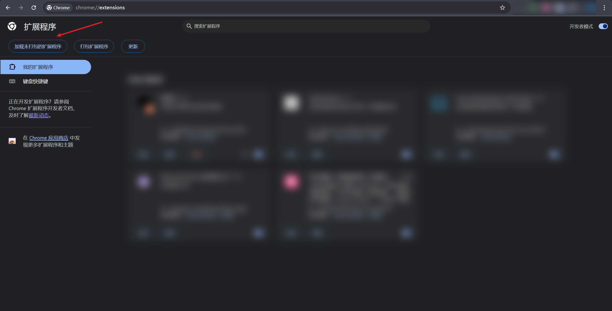

<h1 align="center">AntiDebug_Breaker</h1>


## Intro

本插件是基于<a href="https://github.com/0xsdeo/Hook_JS">Hook_JS</a>库所写的Google插件，将致力于辅助前端JavaScript逆向以及渗透测试信息收集。

如何提交您自己的脚本：<a href="https://github.com/0xsdeo/AntiDebug_Breaker/wiki/%E6%8F%90%E4%BA%A4%E6%82%A8%E8%87%AA%E5%B7%B1%E7%9A%84hook%E8%84%9A%E6%9C%AC">AntiDebug_Breaker wiki</a>

## 教学视频

反调试：https://www.bilibili.com/video/BV1gQ4mzMEA4

Vue：https://www.bilibili.com/video/BV12148z7EnP

Hook CryptoJS对称加密 快速出key、iv、mode、padding：https://www.bilibili.com/video/BV1MPW1zDEK8

JS逆向快速定位加密位置以及获取加密密文等加密参数：https://www.bilibili.com/video/BV1cRyXBaEJX

## 插件安装

将源码下载到本地后打开chrome，访问`chrome://extensions/`，点击左上角的`加载未打包的扩展程序`，然后选中源码文件夹即可：


## 脚本使用场景

>AntiDebug

- <a href="#Bypass_Debugger">Bypass Debugger</a>
- <a href="#hook_log">hook log</a>
- <a href="#Hook_table">Hook table</a>
- <a href="#hook_clear">hook clear</a>
- <a href="#hook_close">hook close</a>
- <a href="#hook_history">hook history</a>
- <a href="#Fixed_window_size">Fixed window size</a>
- <a href="#location_href">页面跳转JS代码定位通杀方案</a>
- <a href="#Hook_CryptoJS">Hook CryptoJS</a>
- <a href="#Hook_JSEncrypt_RSA">Hook JSEncrypt RSA</a>

>Hook

- <a href="#document.cookie">document.cookie</a>
- <a href="#XMLHttpRequest.setRequestHeader">XMLHttpRequest.setRequestHeader</a>
- <a href="#XMLHttpRequest.open">XMLHttpRequest.open</a>
- <a href="#localStorage.setItem">localStorage.setItem</a>
- <a href="#localStorage.getItem">localStorage.getItem</a>
- <a href="#localStorage.removeItem">localStorage.removeItem</a>
- <a href="#localStorage.clear">localStorage.clear</a>
- <a href="#sessionStorage.setItem">sessionStorage.setItem</a>
- <a href="#sessionStorage.getItem">sessionStorage.getItem</a>
- <a href="#sessionStorage.removeItem">sessionStorage.removeItem</a>
- <a href="#sessionStorage.clear">sessionStorage.clear</a>
- <a href="#fetch">fetch</a>
- <a href="#JSON.parse">JSON.parse</a>
- <a href="#JSON.stringify">JSON.stringify</a>
- <a href="#Promise">Promise</a>
- <a href="#Math.random">Math.random</a>
- <a href="#Date.now">Date.now</a>

> Vue

- <a href="#Get_Vue_0">获取路由</a>
- <a href="#Get_Vue_1">清除跳转</a>
- <a href="#Clear_vue_Navigation_Guards">清除路由守卫</a>
- <a href="#detectorExec">激活Vue Devtools</a>

### 反调试

- <a id="Bypass_Debugger" href="https://github.com/0xsdeo/AntiDebug_Breaker/blob/main/scripts/Bypass_Debugger.js">Bypass Debugger</a>

该脚本用于绕过**无限Debugger**，目前引起无限Debugger的三种核心方式为：

> eval

> Function

> Function.prototype.constructor

本脚本通过 Hook 以上核心函数有效绕过大部分前端无限 debugger。但因 eval 作用域问题，某些网站可能会报错。此时可切换至火狐浏览器无视debugger进行调试。

注：极少数网站可能采用特殊反制措施（如故意引发eval作用域问题或其他问题），导致前端报错或依然能引起debugger，这种情况需针对性解决。总体而言，**本脚本能覆盖绝大多数场景**。

脚本原理：<a href="https://mp.weixin.qq.com/s/3xagT-PXCgGrw9YiaCe__g">JS逆向系列14-Bypass Debugger</a>

- <a id="hook_log" href="https://github.com/0xsdeo/AntiDebug_Breaker/blob/main/scripts/hook_log.js">hook log</a>

本脚本为<a href="https://github.com/lyousan">Yosan</a>师傅所作，用于防止js重写console.log等方法。

- <a id="Hook_table" href="https://github.com/0xsdeo/AntiDebug_Breaker/blob/main/scripts/hook_table.js">Hook table</a>

绕过js检测运行时间差来实现反调试。

本脚本将针对以下这三种特征的反调试网站(注：包括但不仅限于这以下三种特征，需根据实际情况去判断是否需要使用本脚本)：

> 频繁调用console.clear清除控制台数据

> 控制台频繁输出大量内容

> 进行完以上两种操作后直接使用location.href进行跳转，一般跳转到主域名为github.io的网站。

如存在以上特征的网站，均可尝试使用本脚本去进行绕过。

脚本原理：<a href="https://mp.weixin.qq.com/s/JZu-fknVdEpaI5anzSlLjg">JS逆向系列19-无感绕过一类运行时间差反调试</a>

- <a id="hook_clear" href="https://github.com/0xsdeo/AntiDebug_Breaker/blob/main/scripts/hook_clear.js">hook clear</a>

禁止js清除控制台数据。

脚本原理：<a href="https://mp.weixin.qq.com/s/r-ZcP2knpmoVEK0y_26xBw">JS逆向系列10-反调试与反反调试</a>

- <a id="hook_close" href="https://github.com/0xsdeo/AntiDebug_Breaker/blob/main/scripts/hook_close.js">hook close</a>

重写close，以此来避免网站反调试关闭当前页面。

脚本原理：<a href="https://mp.weixin.qq.com/s/r-ZcP2knpmoVEK0y_26xBw">JS逆向系列10-反调试与反反调试</a>

- <a id="hook_history" href="https://github.com/0xsdeo/AntiDebug_Breaker/blob/main/scripts/hook_history.js">hook history</a>

避免网站反调试返回上一页或某个特定历史页面。

脚本原理：<a href="https://mp.weixin.qq.com/s/r-ZcP2knpmoVEK0y_26xBw">JS逆向系列10-反调试与反反调试</a>

- <a id="Fixed_window_size" href="https://github.com/0xsdeo/AntiDebug_Breaker/blob/main/scripts/Fixed_window_size.js">Fixed window size</a>

固定浏览器高度宽度值以绕过前端检测用户是否打开控制台。

固定的宽度高度值：
```text
innerHeight：660
innerWidth：1366

outerHeight：760
outerWidth：1400
```

- <a id="location_href" href="https://github.com/0xsdeo/AntiDebug_Breaker/blob/main/scripts/location_href.js">页面跳转JS代码定位通杀方案</a>

本脚本为<a href="https://github.com/CC11001100">CC11001100</a>师傅所作，脚本原地址：`https://github.com/JSREI/page-redirect-code-location-hook`，用于阻断页面跳转，留在当前页面分析。

- <a id="Hook_CryptoJS" href="https://github.com/0xsdeo/AntiDebug_Breaker/blob/main/scripts/Hook_CryptoJS.js">Hook CryptoJS</a>

Hook CryptoJS当中的所有 对称&哈希&HMAC算法，例如AES、DES、MD5、SHA等。如果未打印请自查目标站点是否清除了console.log或是否使用的是CryptoJS的加密算法，如果确认使用的是CryptoJS库进行的加密而无法打印可联系我。

- <a id="Hook_JSEncrypt_RSA" href="https://github.com/0xsdeo/AntiDebug_Breaker/blob/main/scripts/Hook_JSEncrypt.js">Hook JSEncrypt RSA</a>

Hook JSEncrypt加密库中的RSA算法，加密时将在控制台打印公钥、原始数据、加密后的密文。解密时将在控制台打印私钥、原始数据、解密后的明文。如果未打印请自查目标站点是否清除了console.log或是否使用的是JSEncrypt的RSA算法，如果确认使用的是JSEncrypt库进行的RSA加密而无法打印可联系我。

### Hook

- <a id="document.cookie" href="https://github.com/0xsdeo/AntiDebug_Breaker/blob/main/scripts/Hook_cookie.js">document.cookie</a>

开启本脚本后默认将在控制台打印设置的cookie，如果需要打印特定cookie请在下方输入框中输入cookie名称，脚本将会捕获这些特定cookie名。

- <a id="XMLHttpRequest.setRequestHeader" href="https://github.com/0xsdeo/AntiDebug_Breaker/blob/main/scripts/hook_xhr_setRequestHeader.js">XMLHttpRequest.setRequestHeader</a>

开启本脚本后默认将在控制台打印设置的请求头，如果需要打印特定请求头请在下方输入框中输入请求头名称，脚本将会捕获这些特定请求头名。

- <a id="XMLHttpRequest.open" href="https://github.com/0xsdeo/AntiDebug_Breaker/blob/main/scripts/hook_xhr_open.js">XMLHttpRequest.open</a>

开启本脚本后默认将在控制台打印初始化xhr请求配置(url,method)，如果需要捕获特定url请在下方输入框中输入url名称，脚本将会捕获这些特定url名称。

- <a id="localStorage.setItem" href="https://github.com/0xsdeo/AntiDebug_Breaker/blob/main/scripts/hook_localStorage_setItem.js">localStorage.setItem</a>

开启本脚本后默认将在控制台打印设置的localStorage键值，如果需要捕获特定键请在下方输入框中输入键名，脚本将会捕获这些特定键名。

- <a id="localStorage.getItem" href="https://github.com/0xsdeo/AntiDebug_Breaker/blob/main/scripts/hook_localStorage_getItem.js">localStorage.getItem</a>

开启本脚本后默认将在控制台打印站点读取的localStorage键名，如果需要捕获特定键名请在下方输入框中输入键名，脚本将会捕获这些特定键名。

- <a id="localStorage.removeItem" href="https://github.com/0xsdeo/AntiDebug_Breaker/blob/main/scripts/hook_localStorage_removeItem.js">localStorage.removeItem</a>

开启本脚本后默认将在控制台打印移除的localStorage键名，如果需要捕获特定键名请在下方输入框中输入键名，脚本将会捕获这些特定键名。

- <a id="localStorage.clear" href="https://github.com/0xsdeo/AntiDebug_Breaker/blob/main/scripts/hook_localStorage_clear.js">localStorage.clear</a>

开启本脚本后如果站点进行了清空localStorage动作，默认会在控制台打印消息。

- <a id="sessionStorage.setItem" href="https://github.com/0xsdeo/AntiDebug_Breaker/blob/main/scripts/hook_sessionStorage_setItem.js">sessionStorage.setItem</a>

开启本脚本后默认将在控制台打印设置的sessionStorage键值，如果需要捕获特定键请在下方输入框中输入键名，脚本将会捕获这些特定键名。

- <a id="sessionStorage.getItem" href="https://github.com/0xsdeo/AntiDebug_Breaker/blob/main/scripts/hook_sessionStorage_getItem.js">sessionStorage.getItem</a>

开启本脚本后默认将在控制台打印站点读取的sessionStorage键名，如果需要捕获特定键名请在下方输入框中输入键名，脚本将会捕获这些特定键名。

- <a id="sessionStorage.removeItem" href="https://github.com/0xsdeo/AntiDebug_Breaker/blob/main/scripts/hook_sessionStorage_removeItem.js">sessionStorage.removeItem</a>

开启本脚本后默认将在控制台打印移除的sessionStorage键名，如果需要捕获特定键名请在下方输入框中输入键名，脚本将会捕获这些特定键名。

- <a id="sessionStorage.clear" href="https://github.com/0xsdeo/AntiDebug_Breaker/blob/main/scripts/hook_sessionStorage_clear.js">sessionStorage.clear</a>

开启本脚本后如果站点进行了清空sessionStorage动作，默认会在控制台打印消息。

- <a id="fetch" href="https://github.com/0xsdeo/AntiDebug_Breaker/blob/main/scripts/hook_fetch.js">fetch</a>

开启本脚本后默认将在控制台打印fetch请求设置。

- <a id="JSON.parse" href="https://github.com/0xsdeo/AntiDebug_Breaker/blob/main/scripts/hook_json_parse.js">JSON.parse</a>

开启本脚本后默认将在控制台打印传入的JSON，如果需要捕获特定JSON请在下方输入框中输入JSON，脚本将会捕获这些特定JSON字符串。

- <a id="JSON.stringify" href="https://github.com/0xsdeo/AntiDebug_Breaker/blob/main/scripts/hook_json_stringify.js">JSON.stringify</a>

开启本脚本后默认将在控制台打印传入JSON.stringify的值。

- <a id="Promise" href="https://github.com/0xsdeo/AntiDebug_Breaker/blob/main/scripts/hook_Promise.js">Promise</a>

本脚本为<a href="https://github.com/lyousan">Yosan</a>师傅所作。

将在控制台打印Promise的resolve参数，可快速定位异步回调位置。

- <a id="Math.random" href="https://github.com/0xsdeo/AntiDebug_Breaker/blob/main/scripts/hook_random.js">Math.random</a>

固定Math.random返回值

- <a id="Date.now" href="https://github.com/0xsdeo/AntiDebug_Breaker/blob/main/scripts/Hook_Date_now.js">Date.now</a>

固定Date.now返回值

### Vue

- <a id="Get_Vue_0" href="https://github.com/0xsdeo/AntiDebug_Breaker/blob/main/scripts/Get_Vue_0.js">获取路由</a>

获取已加载的路由并显示在下方的表格中，注意未加载的路由不会被获取到，如果长时间未获取到可能是由于目标站点未使用vue router，也可能是因为目标站点未加载完毕。

- <a id="Get_Vue_1" href="https://github.com/0xsdeo/AntiDebug_Breaker/blob/main/scripts/Get_Vue_1.js">清除跳转</a>

本脚本将清除vue router的跳转方法，如果清除后依然会跳转，一方面可能是由于注入的脚本还未清除跳转方法，网站就调用了方法进行跳转，此时可以考虑手动替换js清除跳转方法。另一方面可能是由于在代码中调用的不是vue router的跳转方法，此时可以考虑开启反调试板块中的hook close或hook history脚本，再或者打开页面跳转JS代码定位通杀方案脚本，定位到跳转的函数并替换清除。

- <a id="Clear_vue_Navigation_Guards" href="https://github.com/0xsdeo/AntiDebug_Breaker/blob/main/scripts/Clear_vue_Navigation_Guards.js">清除路由守卫</a>

仅清除全局前置守卫(beforeEach)和全局解析守卫(beforeResolve)，如果清除后网站控制台显示报错，可能是由于在路由守卫中做了动态加载等其他操作，此时可以考虑关闭本脚本并亲自替换js逻辑实现绕过。

脚本原理：<a href="https://mp.weixin.qq.com/s/klhBr2V7UJpspiAmRY1DXQ">最大化收集Vue框架(SPA类型)下的js</a>

- <a id="detectorExec" href="https://github.com/0xsdeo/AntiDebug_Breaker/blob/main/scripts/detectorExec.js">激活Vue Devtools</a>

本脚本引用自<a href="https://github.com/hzmming/vue-force-dev">vue-force-dev</a>。

当开启本脚本后将激活Vue Devtools。Vue2需开启Vue.js devtools(v5)，Vue3需开启Vue.js devtools，可自行去谷歌插件商店安装上述两个插件。注：1.上述两个插件不能同时开。2.当下方没有检测到Vue Router时并不能代表网站不是Vue框架，只能说明网站并没有使用Vue Router。

## 插件使用注意事项

1. 本插件目前不支持火狐。
2. 进入网页后，无论是开启脚本还是关闭脚本，需刷新页面后才会生效。
3. **本插件无法做到自动化添加Vue未加载的路由。**
4. **更新插件时请将旧版本插件从浏览器中移除再导入新版插件。**

## 致谢

致谢个人：<a href="https://github.com/CC11001100">CC11001100</a>、<a href="https://github.com/mingheyan">Dexter</a>、<a href="https://github.com/d1sbb">d1sbb</a>、<a href="https://github.com/lyousan">Yosan</a>

本项目参考过、引用过或正在引用的优质项目：<a href="https://github.com/Ad1euDa1e/VueCrack">VueCrack</a>、<a href="https://github.com/keecth/FakeCryptoJS">FakeCryptoJS</a>、<a href="https://github.com/hzmming/vue-force-dev">vue-force-dev</a>

## Contact

如有bug或其他问题可提交issues，或者关注公众号Spade sec联系我。

## Star History
[](https://starchart.cc/0xsdeo/AntiDebug_Breaker)