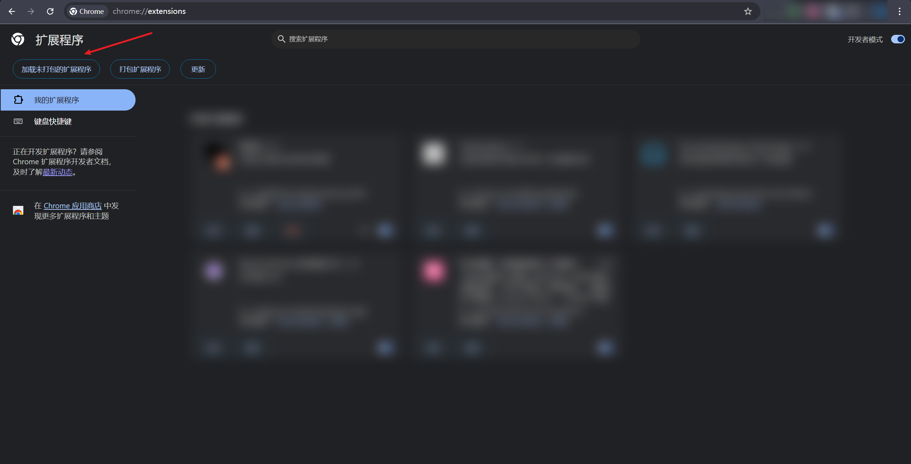

[简体中文](README_zh.md)

## Intro

This extension is a Google Chrome extension based on the <a href="https://github.com/0xsdeo/Hook_JS">Hook_JS</a> library, dedicated to assisting with front-end JavaScript reverse engineering and information gathering during penetration testing.

How to submit your own script: <a href="https://github.com/0xsdeo/AntiDebug_Breaker/wiki/%E6%8F%90%E4%BA%A4%E6%82%A8%E8%87%AA%E5%B7%B1%E7%9A%84hook%E8%84%9A%E6%9C%AC">AntiDebug_Breaker wiki</a>

## Tutorial Videos

Anti-Debugging: https://www.bilibili.com/video/BV1gQ4mzMEA4

Vue: https://www.bilibili.com/video/BV12148z7EnP

Hooking CryptoJS Symmetric Encryption - Quickly extracting key, iv, mode, padding: https://www.bilibili.com/video/BV1MPW1zDEK8

JS Reverse Engineering - Quickly locating encryption positions and acquiring encrypted ciphertext and parameters: https://www.bilibili.com/video/BV1cRyXBaEJX

SpiderDemo Practice Website: https://www.spiderdemo.cn

## Extension Installation

### Install via Google Chrome Web Store

URL: https://chromewebstore.google.com/detail/antidebug-breaker/opkclndfcbafdaecbbaklefnaadopcln

### Manual Installation

Download the source code to your local machine, open Chrome, and navigate to `chrome://extensions/`. Click on `Load unpacked` in the top left corner, then select the source code folder:


## Script Usage Scenarios

> AntiDebug

- <a href="#Bypass_Debugger">Bypass Debugger</a>
- <a href="#hook_log">Hook log</a>
- <a href="#Hook_table">Hook table</a>
- <a href="#hook_clear">Hook clear</a>
- <a href="#hook_close">Hook close</a>
- <a href="#hook_history">Hook history</a>
- <a href="#Fixed_window_size">Fixed window size</a>
- <a href="#location_href">Universal solution for locating page redirection JS code</a>
- <a href="#Hook_CryptoJS">Hook CryptoJS</a>
- <a href="#Hook_JSEncrypt_RSA">Hook JSEncrypt RSA</a>
- <a href="#Hook_SMcrypto">Hook SM-crypto</a>

> Hook

- <a href="#document.cookie">document.cookie</a>
- <a href="#XMLHttpRequest.setRequestHeader">XMLHttpRequest.setRequestHeader</a>
- <a href="#XMLHttpRequest.open">XMLHttpRequest.open</a>
- <a href="#localStorage.setItem">localStorage.setItem</a>
- <a href="#localStorage.getItem">localStorage.getItem</a>
- <a href="#localStorage.removeItem">localStorage.removeItem</a>
- <a href="#localStorage.clear">localStorage.clear</a>
- <a href="#sessionStorage.setItem">sessionStorage.setItem</a>
- <a href="#sessionStorage.getItem">sessionStorage.getItem</a>
- <a href="#sessionStorage.removeItem">sessionStorage.removeItem</a>
- <a href="#sessionStorage.clear">sessionStorage.clear</a>
- <a href="#fetch">fetch</a>
- <a href="#JSON.parse">JSON.parse</a>
- <a href="#JSON.stringify">JSON.stringify</a>
- <a href="#Promise">Promise</a>
- <a href="#Math.random">Math.random</a>
- <a href="#Date.now">Date.now</a>
- <a href="#performance.now">performance.now</a>

> Vue

- <a href="#Get_Vue_0">Get Routes</a>
- <a href="#Get_Vue_1">Clear Redirections</a>
- <a href="#Clear_vue_Navigation_Guards">Clear Navigation Guards</a>
- <a href="#detectorExec">Activate Vue Devtools</a>

### Anti-Debugging

- <a id="Bypass_Debugger" href="https://github.com/0xsdeo/AntiDebug_Breaker/blob/main/scripts/Bypass_Debugger.js">Bypass Debugger</a>

This script is used to bypass **infinite Debugger**. Currently, the three core methods that trigger infinite Debugger are:

> eval

> Function

> Function.prototype.constructor

By hooking the above core functions, this script effectively bypasses most front-end infinite debuggers. However, due to scope issues with `eval`, some websites might throw errors. In such cases, you can switch to the Firefox browser to ignore the debugger and continue debugging.

Note: A very small number of websites may employ special countermeasures (e.g., intentionally causing `eval` scope issues or other problems), resulting in front-end errors or still triggering the debugger, which requires targeted solutions. Overall, **this script covers the vast majority of scenarios**.

Script principle: <a href="https://mp.weixin.qq.com/s/3xagT-PXCgGrw9YiaCe__g">JS Reverse Engineering Series 14 - Bypass Debugger</a>

- <a id="hook_log" href="https://github.com/0xsdeo/AntiDebug_Breaker/blob/main/scripts/hook_log.js">Hook log</a>

This script was written by <a href="https://github.com/lyousan">Yosan</a> to prevent JavaScript from overriding methods like `console.log`.

- <a id="Hook_table" href="https://github.com/0xsdeo/AntiDebug_Breaker/blob/main/scripts/hook_table.js">Hook table</a>

Bypasses JS detection of execution time differences used for anti-debugging.

This script targets anti-debugging websites with the following three characteristics (Note: It includes but is not limited to these three characteristics; you need to judge whether to use this script based on the actual situation):

> Frequently calling `console.clear` to clear console data.

> The console frequently outputs a large amount of content.

> Directly using `location.href` to redirect after performing the above two operations, generally redirecting to a website with the main domain `github.io`.

If a website has the above characteristics, you can try using this script to bypass it.

Script principle: <a href="https://mp.weixin.qq.com/s/JZu-fknVdEpaI5anzSlLjg">JS Reverse Engineering Series 19 - Seamlessly Bypassing Anti-Debugging Based on Execution Time Differences</a>

- <a id="hook_clear" href="https://github.com/0xsdeo/AntiDebug_Breaker/blob/main/scripts/hook_clear.js">Hook clear</a>

Prevents JS from clearing console data.

Script principle: <a href="https://mp.weixin.qq.com/s/r-ZcP2knpmoVEK0y_26xBw">JS Reverse Engineering Series 10 - Anti-Debugging and Anti-Anti-Debugging</a>

- <a id="hook_close" href="https://github.com/0xsdeo/AntiDebug_Breaker/blob/main/scripts/hook_close.js">Hook close</a>

Overrides `close` to prevent the website's anti-debugging mechanism from closing the current page.

Script principle: <a href="https://mp.weixin.qq.com/s/r-ZcP2knpmoVEK0y_26xBw">JS Reverse Engineering Series 10 - Anti-Debugging and Anti-Anti-Debugging</a>

- <a id="hook_history" href="https://github.com/0xsdeo/AntiDebug_Breaker/blob/main/scripts/hook_history.js">Hook history</a>

Prevents the website's anti-debugging mechanism from returning to the previous page or a specific historical page.

Script principle: <a href="https://mp.weixin.qq.com/s/r-ZcP2knpmoVEK0y_26xBw">JS Reverse Engineering Series 10 - Anti-Debugging and Anti-Anti-Debugging</a>

- <a id="Fixed_window_size" href="https://github.com/0xsdeo/AntiDebug_Breaker/blob/main/scripts/Fixed_window_size.js">Fixed window size</a>

Fixes the browser height and width values to bypass front-end detection of whether the user has opened the console.

Fixed width and height values:
```text
innerHeight: 660
innerWidth: 1366

outerHeight: 760
outerWidth: 1400
```

- <a id="location_href" href="https://github.com/0xsdeo/AntiDebug_Breaker/blob/main/scripts/location_href.js">Universal solution for locating page redirection JS code</a>

This script was written by <a href="https://github.com/CC11001100">CC11001100</a>. Original script URL: `https://github.com/JSREI/page-redirect-code-location-hook`. It is used to block page redirection and stay on the current page for analysis.

- <a id="Hook_CryptoJS" href="https://github.com/0xsdeo/AntiDebug_Breaker/blob/main/scripts/Hook_CryptoJS.js">Hook CryptoJS</a>

Hooks all Symmetric & Hash & HMAC algorithms in CryptoJS, such as AES, DES, MD5, SHA, etc. If it is not printed, please check whether the target site has cleared `console.log` or whether it uses CryptoJS encryption algorithms. If you confirm that it uses the CryptoJS library for encryption but cannot print, you can contact me.

- <a id="Hook_JSEncrypt_RSA" href="https://github.com/0xsdeo/AntiDebug_Breaker/blob/main/scripts/Hook_JSEncrypt.js">Hook JSEncrypt RSA</a>

Hooks the RSA algorithm in the JSEncrypt library. During encryption, the public key, original data, and encrypted ciphertext will be printed in the console. During decryption, the private key, original data, and decrypted plaintext will be printed in the console. If it is not printed, please check whether the target site has cleared `console.log` or whether it uses the JSEncrypt RSA algorithm. If you confirm that it uses the JSEncrypt library for RSA encryption but cannot print, you can contact me.

- <a id="Hook_SMcrypto" href="https://github.com/0xsdeo/AntiDebug_Breaker/blob/main/scripts/Hook_SMcrypto.js">Hook SM-crypto</a>

The idea and initial form of this script were created by <a href="https://github.com/Hosinoharu">魔法少女☆ホシノ</a>.

Hooks the SM2, SM3, and SM4 algorithms in the SM-crypto encryption library. If it is not printed, please check whether the target site has cleared `console.log` or whether it uses sm-crypto encryption algorithms. If `console.log` is cleared, you can try using the `hook log` script to prevent js from overriding the log method. If you confirm that it uses the sm-crypto library for encryption but cannot print, you can contact me.

### Hook

- <a id="document.cookie" href="https://github.com/0xsdeo/AntiDebug_Breaker/blob/main/scripts/Hook_cookie.js">document.cookie</a>

When this script is enabled, it will print the set cookie in the console by default. If you need to print a specific cookie, please enter the cookie name in the input box below, and the script will capture these specific cookie names.

- <a id="XMLHttpRequest.setRequestHeader" href="https://github.com/0xsdeo/AntiDebug_Breaker/blob/main/scripts/hook_xhr_setRequestHeader.js">XMLHttpRequest.setRequestHeader</a>

When this script is enabled, it will print the set request headers in the console by default. If you need to print specific request headers, please enter the request header name in the input box below, and the script will capture these specific request header names.

- <a id="XMLHttpRequest.open" href="https://github.com/0xsdeo/AntiDebug_Breaker/blob/main/scripts/hook_xhr_open.js">XMLHttpRequest.open</a>

When this script is enabled, it will print the initial xhr request configuration (url, method) in the console by default. If you need to capture a specific url, please enter the url name in the input box below, and the script will capture these specific url names.

- <a id="localStorage.setItem" href="https://github.com/0xsdeo/AntiDebug_Breaker/blob/main/scripts/hook_localStorage_setItem.js">localStorage.setItem</a>

When this script is enabled, it will print the set localStorage key-value pairs in the console by default. If you need to capture a specific key, please enter the key name in the input box below, and the script will capture these specific key names.

- <a id="localStorage.getItem" href="https://github.com/0xsdeo/AntiDebug_Breaker/blob/main/scripts/hook_localStorage_getItem.js">localStorage.getItem</a>

When this script is enabled, it will print the localStorage key names read by the site in the console by default. If you need to capture a specific key name, please enter the key name in the input box below, and the script will capture these specific key names.

- <a id="localStorage.removeItem" href="https://github.com/0xsdeo/AntiDebug_Breaker/blob/main/scripts/hook_localStorage_removeItem.js">localStorage.removeItem</a>

When this script is enabled, it will print the removed localStorage key names in the console by default. If you need to capture a specific key name, please enter the key name in the input box below, and the script will capture these specific key names.

- <a id="localStorage.clear" href="https://github.com/0xsdeo/AntiDebug_Breaker/blob/main/scripts/hook_localStorage_clear.js">localStorage.clear</a>

When this script is enabled, if the site performs an action to clear localStorage, it will print a message in the console by default.

- <a id="sessionStorage.setItem" href="https://github.com/0xsdeo/AntiDebug_Breaker/blob/main/scripts/hook_sessionStorage_setItem.js">sessionStorage.setItem</a>

When this script is enabled, it will print the set sessionStorage key-value pairs in the console by default. If you need to capture a specific key, please enter the key name in the input box below, and the script will capture these specific key names.

- <a id="sessionStorage.getItem" href="https://github.com/0xsdeo/AntiDebug_Breaker/blob/main/scripts/hook_sessionStorage_getItem.js">sessionStorage.getItem</a>

When this script is enabled, it will print the sessionStorage key names read by the site in the console by default. If you need to capture a specific key name, please enter the key name in the input box below, and the script will capture these specific key names.

- <a id="sessionStorage.removeItem" href="https://github.com/0xsdeo/AntiDebug_Breaker/blob/main/scripts/hook_sessionStorage_removeItem.js">sessionStorage.removeItem</a>

When this script is enabled, it will print the removed sessionStorage key names in the console by default. If you need to capture a specific key name, please enter the key name in the input box below, and the script will capture these specific key names.

- <a id="sessionStorage.clear" href="https://github.com/0xsdeo/AntiDebug_Breaker/blob/main/scripts/hook_sessionStorage_clear.js">sessionStorage.clear</a>

When this script is enabled, if the site performs an action to clear sessionStorage, it will print a message in the console by default.

- <a id="fetch" href="https://github.com/0xsdeo/AntiDebug_Breaker/blob/main/scripts/hook_fetch.js">fetch</a>

When this script is enabled, it will print the fetch request settings in the console by default.

- <a id="JSON.parse" href="https://github.com/0xsdeo/AntiDebug_Breaker/blob/main/scripts/hook_json_parse.js">JSON.parse</a>

When this script is enabled, it will print the passed JSON in the console by default. If you need to capture a specific JSON, please enter the JSON in the input box below, and the script will capture these specific JSON strings.

- <a id="JSON.stringify" href="https://github.com/0xsdeo/AntiDebug_Breaker/blob/main/scripts/hook_json_stringify.js">JSON.stringify</a>

When this script is enabled, it will print the value passed to JSON.stringify in the console by default.

- <a id="Promise" href="https://github.com/0xsdeo/AntiDebug_Breaker/blob/main/scripts/hook_Promise.js">Promise</a>

This script was written by <a href="https://github.com/lyousan">Yosan</a>.

It will print the resolve parameters of a Promise in the console, allowing you to quickly locate the position of asynchronous callbacks.

- <a id="Math.random" href="https://github.com/0xsdeo/AntiDebug_Breaker/blob/main/scripts/hook_random.js">Math.random</a>

Fixes the return value of `Math.random`.

- <a id="Date.now" href="https://github.com/0xsdeo/AntiDebug_Breaker/blob/main/scripts/Hook_Date_now.js">Date.now</a>

Fixes the return value of `Date.now`.

- <a id="performance.now" href="https://github.com/0xsdeo/AntiDebug_Breaker/blob/main/scripts/hook_performance_now.js">performance.now</a>

Fixes the return value of `performance.now`.

### Vue

- <a id="Get_Vue_0" href="https://github.com/0xsdeo/AntiDebug_Breaker/blob/main/scripts/Get_Vue_0.js">Get Routes</a>

Gets the loaded routes and displays them in the table below. Note that unloaded routes will not be captured. If no routes are captured for a long time, it may be because the target site does not use Vue Router, or because the target site has not completely loaded.

- <a id="Get_Vue_1" href="https://github.com/0xsdeo/AntiDebug_Breaker/blob/main/scripts/Get_Vue_1.js">Clear Redirections</a>

This script will clear the Vue router's redirection methods. If it still redirects after clearing, on the one hand, it may be because the injected script hasn't cleared the redirection method before the website calls it to redirect. At this time, you can consider manually replacing JS to clear the redirection method. On the other hand, it may be because what is called in the code is not a Vue router redirection method. In this case, you can consider enabling the `hook close` or `hook history` scripts in the anti-debugging section, or open the "Universal solution for locating page redirection JS code" script to locate the redirection function and replace/clear it.

- <a id="Clear_vue_Navigation_Guards" href="https://github.com/0xsdeo/AntiDebug_Breaker/blob/main/scripts/Clear_vue_Navigation_Guards.js">Clear Navigation Guards</a>

Only clears global before guards (`beforeEach`) and global resolve guards (`beforeResolve`). If the website console displays errors after clearing, it may be due to other operations like dynamic loading done within the navigation guards. At this time, you can consider disabling this script and manually replacing JS logic to achieve bypass.

Script principle: <a href="https://mp.weixin.qq.com/s/klhBr2V7UJpspiAmRY1DXQ">Maximizing JS collection under the Vue framework (SPA type)</a>

- <a id="detectorExec" href="https://github.com/0xsdeo/AntiDebug_Breaker/blob/main/scripts/detectorExec.js">Activate Vue Devtools</a>

This script is referenced from <a href="https://github.com/hzmming/vue-force-dev">vue-force-dev</a>.

When this script is enabled, Vue Devtools will be activated. Vue2 requires enabling Vue.js devtools(v5), and Vue3 requires enabling Vue.js devtools. You can install these two extensions from the Google Chrome Web Store yourself. Note: 1. These two extensions cannot be enabled at the same time. 2. When Vue Router is not detected below, it doesn't mean the website is not a Vue framework; it only means the website doesn't use Vue Router.

## Extension Usage Notes

1. This extension currently does not support Firefox.
2. After entering a webpage, whether enabling or disabling a script, you need to refresh the page for it to take effect.
3. **When updating the extension, please remove the old version from the browser before importing the new version.**

## Acknowledgements

Personal acknowledgements: <a href="https://github.com/Hosinoharu">魔法少女☆ホシノ</a>, <a href="https://github.com/CC11001100">CC11001100</a>, <a href="https://github.com/mingheyan">Dexter</a>, <a href="https://github.com/d1sbb">d1sbb</a>, <a href="https://github.com/lyousan">Yosan</a>

Excellent projects that this project has referenced, cited, or is citing: <a href="https://github.com/Ad1euDa1e/VueCrack">VueCrack</a>, <a href="https://github.com/keecth/FakeCryptoJS">FakeCryptoJS</a>, <a href="https://github.com/hzmming/vue-force-dev">vue-force-dev</a>

## Contact

If you find any bugs or have other questions, you can submit issues, or follow the WeChat official account "Spade sec" to contact me.

If you want to join the communication group, you can add my WeChat: I-0xsdeo.

## License

This tool is prohibited from unauthorized commercial use, and unauthorized commercial use after secondary development is prohibited.

## 404 StarLink Project


AntiDebug_Breaker has now joined the [404 StarLink Project](https://github.com/knownsec/404StarLink)

## Star History
[](https://starchart.cc/0xsdeo/AntiDebug_Breaker)
